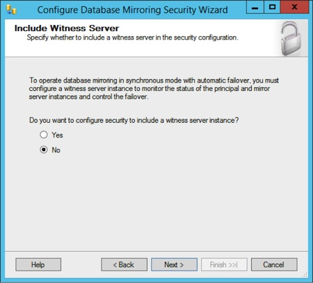

Testing out Ghostwriter, an editor for writing blog posts using markdown.

Inserting a test image here:

	

But how can I center or resize images in markdown?

Oh, I should just save the image to the local directory, and then push everything from github desktop.

Like this image, for example:

oh! i think i need to run this editor from the /Blogs directory instead. 

trying this again

